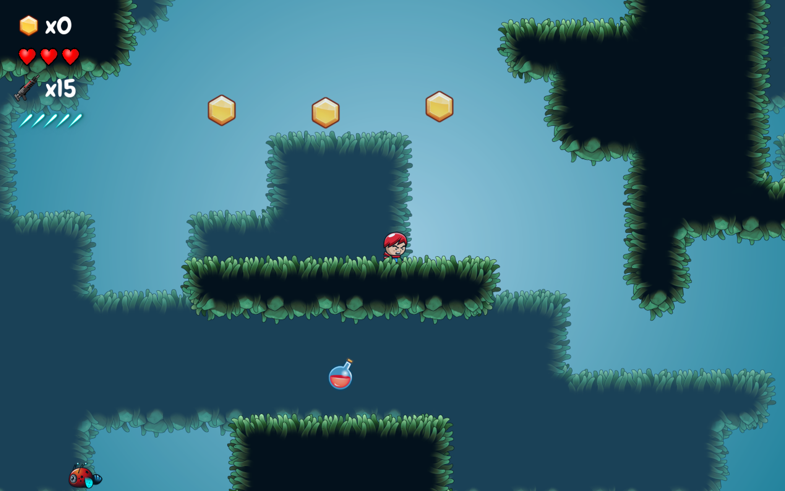
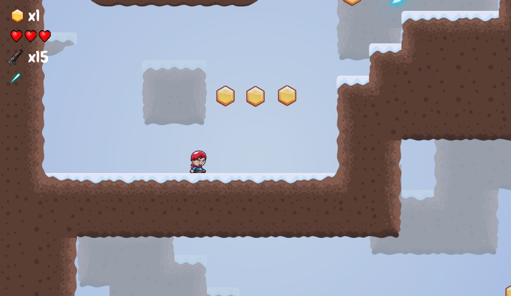
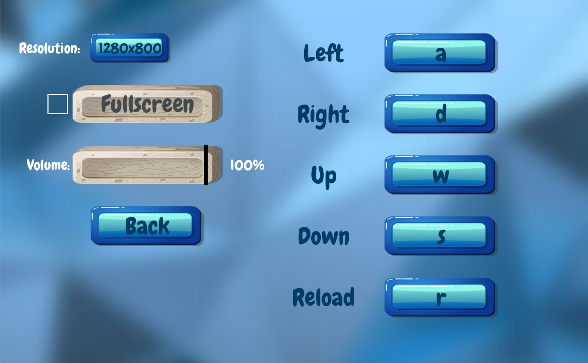
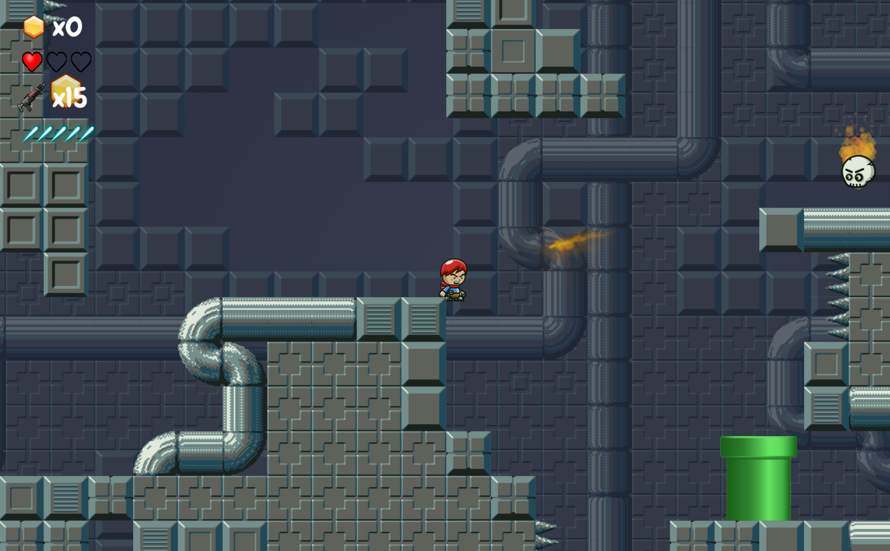

# Jack the Explorer

## Intro

Jack the Explorer is a 2D platformer game about an adventurer seeking to gather the jewels scattered across dangerous realms.

This readme file outlines installation and usage instructions, as well as details of development and implementation.

## Usage

The following packages must be installed:

- python (version >3.10.12)
- virtualenv (or python3-venv)
- GNU make

First install the required libraries:

```
make install
```

Run the game from the terminal with the command:

```
make run
```

To build an executable for windows run the *exec.bat* script.

To build an executable for linux run the *run.bash* script.

Building the static linked executable requires Python and the required libraries to be already installed on the machine.

## Technologies used

The game is written in Python using several libraries:

* Pygame
* Pymunk
* PyTMX
* ParticlePy

In addition, the open source program Tiled was used to design the maps which are imported in the game using PyTMX.

## Gameplay





### Levels


## Main components


### Player class

The Player class represents the main character in the game, with movement, jumping, combat, and interaction abilities. It uses pymunk for physics-based actions such as gravity, impulse, and collision detection.

* **Movement**: The player can move left and right, jump with a customizable number of jump impulses, and interact with platforms and tunnels.
* **Health**: The player starts with 3 lives and a health bar that can be replenished via health boxes.
* **Combat**: The player can pick up and use ammo, collect coins, and deal damage to enemies. Collision with enemies or spikes causes the player to take damage or die.
* **Animations**: The player has idle, running, jumping, falling, and hit animations.
* **Respawn and death**: If the player dies, they respawn at a checkpoint or restart the level upon losing all lives.
* **Weapon**: The player can equip and fire weapons, with a reload mechanic for ammo.


### Enemies: Flower Enemies and Spike Traps

* **Enemy Flower**: A flower-themed enemy that moves between two points, shoots fire at the player, and creates a fiery particle effect. It triggers an explosion upon death.
* **Spike**: A stationary enemy spike that can be rotated, dealing damage to the player on contact.
* **SpikeTile**: A spike hazard embedded within the environment, causing damage when stepped on.

### Tile system

This document provides an overview of the tile system implemented in the game, highlighting the modular design, custom tile classes, and the integration of collision and rendering mechanics.

1. MossyTile

* Implements a mossy-themed tile with its unique color palette and gradient.

2. SciFiTile

* Implements a sci-fi-themed tile with a futuristic color scheme.

3. WinterTile

* Implements a winter-themed tile with cool gradient tones.

Other features

* Collision properties are managed using the collision module and mapped to specific layers for gameplay mechanics.
* Visual elements leverage pygame for rendering.
* Physics interactions are supported through pymunk.